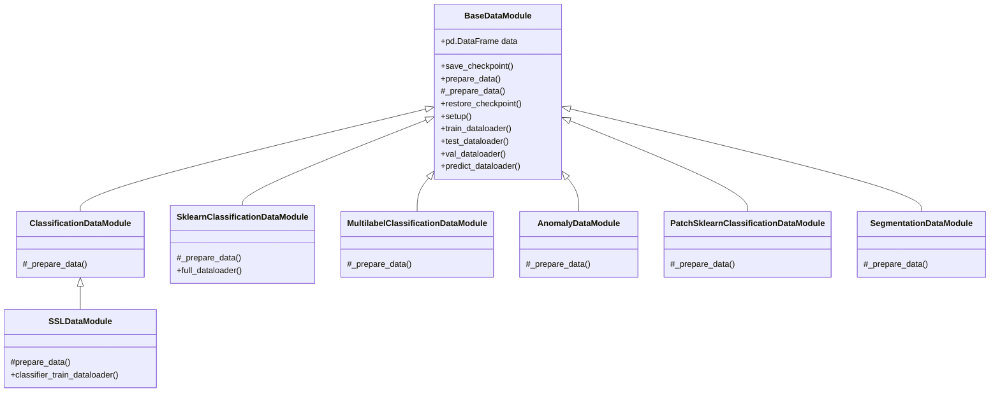

# DataModules

DataModule classes handle the data loading and preprocessing. They are consuming dataset classes defined under `quadra.datasets`. The generic datasets that will be used for different projects have to be implemented in `quadra` library.
## DataModule Hierarchy



Quadra DataModules are an extension of `pytorch_lightning` DataModules. They are inheriting from `BaseDataModule` class and must reimplement the `_prepare_data` function. 

This function will be called from the `prepare_data` function of the base class and it's designed in such a way that data preparation (download, extract, load etc.) and the split creation will be done only once even in a distributed environment.

The `prepare_data` function of the base class will be called from `pytorch_lightning` when a fit, test or prediction operation is performed.Data location, labelling and division will be saved inside a pandas dataframe and the whole DataModule will be saved on disk as a pickle object which will be loaded when the `setup` function is called (again from lightning).

!!! warning

    Since we are saving the DataModule on disk all its attributes must be serializable.

If lightning is not used, the `prepare_data` and `setup` functions must be called manually to prepare the data and setup the DataModule.

## Organizing the Data 

A detailed overview of data organization is given inside the tutorial of each kind of task.
### Classification

Classification datasets are divided with folder names without having any subfolders. If there are many subfolders, the leaf folder name will be used as the label.

```tree
project_root_folder/
├── class_0
│   └── xyz.png
├── class_N
│   └── xyz.png
├── test.txt (Optional)
├── train.txt (Optional)
└── val.txt (Optional)
```
Each split file should contain relative path to dataset root.

```txt
class_0/xyz.png
...
```

### Self-supervised 

This tasks follows the same data structure of the classification tasks.


### Segmentation

If you are using the base DataModule for segmentation tasks, organizing your images and masks with a given optional split files is enough to load the data.

```tree
project_root_folder/
├── images
│   └── xyz.png
├── masks
│   └── xyz.png
├── test.txt (Optional)
├── train.txt (Optional)
└── val.txt (Optional)
```

Each split file should contain relative path to dataset root.
```txt
images/xyz.png
...
```

### Anomaly Detection

Anomaly detection tasks expects only good (images without anomalies) for the training set and both good and (optionally) anomaly images for the test set.

```tree
project_root_folder/
├── train 
│   └── good
│       └── xyz.png
├── val 
│   ├── good
│   │   └── xyz.png
│   ├── defect_type_1
│   │   └── xyz.png
│   └── defect_type_N
│       └── xyz.png
├── test
│   ├── good
│   │   └── xyz.png
│   ├── defect_type_1
│   │   └── xyz.png
│   └── defect_type_N
│       └── xyz.png
└── ground_truth
    ├── good
    │   │ # good images do not require ground truth masks
    │   └── (optional)xyz.png
    ├── defect_type_1
    │   │ # masks for defects can have an optional suffix such as `xyz_mask.png`
    │   └── xyz_<suffix>.png
    └── defect_type_N
        └── xyz_<suffix>.png
```

## Extending base DataModules

To extend the base datamodule is necessary to implement the `_prepare_data` function. This function should do all the necessary operations to prepare your data and split it into train, test and validation sets. The data should be saved inside the `data` attribute of the class. This attribute is a pandas dataframe with the following columns:

  - `samples`: paths to the image files
  - `targets`: label of the image (type of the label is defined by the task)
  - `split`: split of the image (train, test or val)

These are generally the required fields, different tasks may require additional fields. For example, in the case of segmentation tasks, the `masks` field is required.


## Data hashing

During `prepare_data` call of each datamodule we apply hashing algorithm for each sample of the dataset. This information helps developer to track not only the data path used for the experiment but also to track the data content. This is useful when the data is stored in a remote location and the developer wants to check if the data is the same as the one used for the experiment. [BaseDataModule][quadra.datamodules.base.BaseDataModule] class has following arguments to control the hashing process:

  - `enable_hashing`: If `True` the data will be hashed.
  - `hashing_algorithm`: Size of the hash. Must be one of [32, 64, 128]. Defaults to 64.
  - `hashing_chunk_size`: Type of hash to use, if content hash is used, the hash is computed on the file content, otherwise the hash is computed on the file size which is faster but less safe. Defaults to `content`.

After the training is completed. The hash value of each sample used from given dataset will be saved under `hash` column inside `<experiment_folder>/data/dataset.csv` file.

!!! info 
  If the user wants to disable hashing from command line, it is possible to pass `datamodule.enable_hashing=False` as override argument.