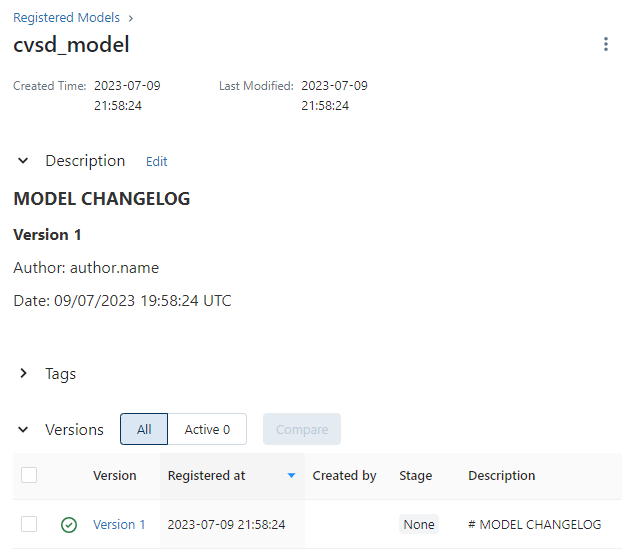
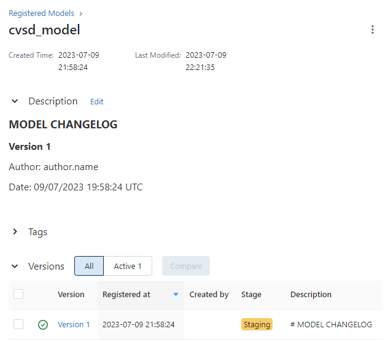
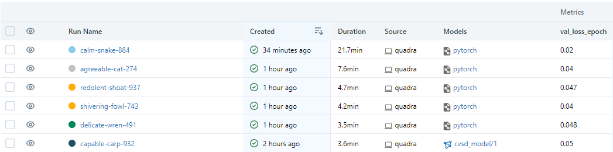
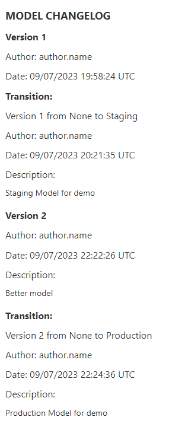

# Model Management

## Overview

Model Management is the process of maintaining and orchestrating the lifecycle of machine learning models. It involves steps such as model creation, training, evaluation, deployment, and monitoring, among other steps. Model Versioning, on the other hand, allows data scientists to track and manage different versions of models during the model's lifecycle. It's crucial for reproducibility, collaboration, and consistent model performance. Quadra, out-of-the-box, supports managing models and their versions through [`MlflowModelManager`][quadra.utils.model_manager.MlflowModelManager] wrapper class with the help of [Mlflow](https://mlflow.org/) library. 

 [`MlflowModelManager`][quadra.utils.model_manager.MlflowModelManager] is an extension of [`AbstractModelManager`][quadra.utils.model_manager.AbstractModelManager] which serves as a blueprint for model managers and specifies the required methods for managing models. It includes methods such as:

- Register the model
- Retrieve latest version
- Transition the model to a new stage
- Delete the model 

By defining an abstract class, we establish a common interface that can be implemented by different model managers besides Mlflow.


## Example Usage

In this section, we will create example project for segmentation task and use [`MlflowModelManager`][quadra.utils.model_manager.MlflowModelManager] to manage the production model. `Quadra` provides a toy example where you can train a segmentation model for Oxford-IIIT Pet Dataset. 

!!!note
    You can find a detailed explanation for customizing the segmentation task under [Segmentation Example](../tutorials/examples/segmentation.md) section.

First of all, we need to run `Mlflow` server with artifact store. You can find the instructions for running `Mlflow` server [here](https://mlflow.org/docs/latest/tracking.html#mlflow-tracking-servers). Let's open a new terminal and run the following command:

```bash
mlflow server \
--backend-store-uri sqlite:///mlflow.db \
--default-artifact-root file:///tmp/mlflow \
--host 0.0.0.0
```

Then, we can start training from different terminal window while `Mlflow` server is running:

```bash
MLFLOW_TRACKING_URI="http://localhost:5000" \
quadra experiment=generic/oxford_pet/segmentation/smp \
trainer.max_epochs=5 \
core.name=cats_vs_dogs \
backbone.model.arch=unet,unetplusplus \
backbone.model.encoder_name=resnet18,resnet50 \
--multirun
```

This command will train a segmentation model for 5 epochs and save experiments run under `cats_vs_dogs` experiment tab. It will run the same experiment with different backbones or segmentation model architectures. After all trainings are completed, we open up the `Mlflow` UI and see experiments run under `cats_vs_dogs` directory. Under the artifacts section of each run, we can find `Mlflow` model artifact under the `deployment_model` directory. Other folders contains metadata or reports about the experiment run.

### Registering the Model

After all runs are completed, we can register the best model with the following command:

```python
import os
from quadra.utils.model_manager import MlflowModelManager
os.environ["MLFLOW_TRACKING_URI"] = "http://localhost:5000"

manager = MlflowModelManager()
manager.register_best_model(experiment_name="cats_vs_dogs",
                            # metric we want to use for selecting the best model
                            metric="val_loss_epoch", 
                            # model path under the artifact store
                            model_path="deployment_model", 
                            # the name of the model to be registered
                            model_name="cvsd_model", 
                            # optional tags
                            tags={"type":"segmentation"}, 
                            # metric sorting order for selecting the best model
                            mode="min")  
```

<p align="center">
    <figure>
        
        <figcaption>Registered Model</figcaption>
    </figure>
</p>


### Staging the Model

After registering the model, we can transition the model to a new stage. We can transition the model to `staging` stage with the following command:

```python
manager.transition_model(model_name="cvsd_model",
                        version=1,
                        stage="staging",
                        description="Staging Model for demo")
```

<p align="center">
    <figure>
        
        <figcaption>Staged Model</figcaption>
    </figure>
</p>


### Update the Model

Let's say we want to update the model with better performance. Let's train the one of the configuration with more epochs and register the model again:

```bash
MLFLOW_TRACKING_URI="http://localhost:5000" \
quadra experiment=generic/oxford_pet/segmentation/smp \
trainer.max_epochs=20 \
core.name=cats_vs_dogs \
backbone.model.arch=unetplusplus \
backbone.model.encoder_name=resnet50 
```

With this new model, we have improved `val_loss_epoch` metric compared to the previous model.

<p align="center">
    <figure>
        
        <figcaption>Comparison of Runs</figcaption>
    </figure>
</p>

Let's register the new model with the following command:

```python
manager.register_model(model_location="runs:/<run-id>/deployment_model/model.pt",
                       model_name="cvsd_model",
                       tags={"type":"smp"},
                       description="Better model"
                       )
```

and finally transition the model to `production` stage:

```python
manager.transition_model(model_name="cvsd_model",
                        version=2,
                        stage="production",
                        description="Production Model for demo")
```

!!!note
    When we visit the model page from Mlflow UI, we can see the model version and stage information under the `Versions` tab. Moreover, we can see the model history automatically stored under the `Description` field.

    <p align="center">
        <figure>
            
            <figcaption>Model Transition History</figcaption>
        </figure>
    </p>


